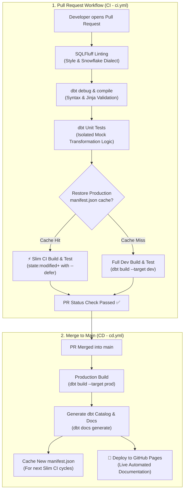

# 🚀 Scalable dbt-Snowflake ELT Framework & CI/CD Engine

[](https://github.com/ronak-2002/dbt-snowflake-elt-framework/actions/workflows/ci.yml)
[](https://github.com/ronak-2002/dbt-snowflake-elt-framework/actions/workflows/cd.yml)
[](https://ronak-2002.github.io/dbt-snowflake-elt-framework/#!/overview)
[](https://www.snowflake.com/)

A production-grade, enterprise-ready data transformation engine built on **dbt Core** and **Snowflake**. This repository implements a bulletproof **CI/CD automation pipeline** using GitHub Actions, bringing modern software engineering principles (state deferral, static linting, isolated mock testing, and automated documentation hosting) into data engineering.

---

## 📂 Project Deep Dive: MovieLens ELT Implementation

Looking for the data transformations, Medallion models (Bronze/Silver/Gold), or test suites?

👉 **[Explore the MovieLens dbt Project Documentation](movielens/README.md)**

> **What's inside?**
> - **Medallion Data Lineage**: Complete raw stage to curated gold marts flow with Mermaid DAG.
> - **Dimensional Modeling**: Kimball fact (`fct_ratings`, `fct_tags`) and dimension (`dim_movies`, `dim_genres`, `dim_links`, `dim_genome_relevance`) structures.
> - **Change Data Capture (CDC)**: SCD Type 2 tracking via dbt snapshots using the `check` strategy.
> - **Multi-Tier Testing**: Unit tests on mock inputs, generic schema constraints, and singular assertions.
> - **Interactive Lineage**: Direct link to the live hosted **[dbt Docs Catalog](https://ronak-2002.github.io/dbt-snowflake-elt-framework/#!/overview)**.

---

## 🔁 Continuous Integration & Continuous Delivery (CI/CD) Architecture

Our CI/CD workflow treats analytics code with the same rigor as mission-critical application software:



---

## 🛡️ Engineering Principles for a Fail-Proof ELT System

### 1. Shift-Left Quality Assurance
Failures are caught in seconds before queries ever execute on Snowflake compute:
- **Static Code Analysis (`SQLFluff`)**: Enforces uppercase keywords, explicit join syntax, column ordering rules, and Snowflake dialect standards.
- **Isolated Unit Testing (`dbt test --select "test_type:unit"`)**: Runs deterministic unit tests against mock datasets in CTEs to verify complex regex and deduplication logic without reading production tables.

### 2. Cost-Effective "Slim CI" with State Deferral
In a large data warehouse, rebuilding untouched upstream models during a PR wastes warehouse compute and developer time:
- The CD pipeline caches the production `manifest.json` on every successful merge.
- The CI pipeline restores this manifest and runs:
  ```bash
  dbt build --select "state:modified+" --defer --state ./prod_manifest
  ```
- **Result**: Only modified models and their immediate downstream dependencies are compiled, built, and tested in the dev environment. All un-modified parent models are deferred directly to production relations.

### 3. Environment Isolation & Parity
- **Dev Sandbox (`target: dev`)**: Pull request builds run against an isolated sandbox database (`movielens_dev`) with role and warehouse isolation.
- **Production Gate (`target: prod`)**: The production database (`movielens_prod`) is updated solely upon merging to `main` through strict GitHub Actions environment protections.

### 4. Continuous Knowledge Delivery
Every merge to `main` automatically compiles documentation and publishes an updated catalog and interactive lineage graph to **GitHub Pages**, ensuring documentation never drifts from code.

---

## 📁 Repository Structure

```text
├── .github/
│   └── workflows/
│       ├── ci.yml                 # PR automation: Lint, Unit Test, Slim CI
│       └── cd.yml                 # Deployment automation: Prod build & GitHub Pages
├── movielens/                     # dbt Project root
│   ├── models/
│   │   ├── sources.yml            # Raw S3 stage definitions
│   │   ├── bronze/                # High-fidelity typed ingestion layer
│   │   ├── silver/                # Conformed dimensional Kimball layer
│   │   └── gold/                  # Analytics data marts (materialized as tables)
│   ├── snapshots/                 # SCD Type 2 tracking (movies_snapshot.sql)
│   ├── tests/                     # Singular custom data assertion tests
│   ├── macros/                    # Custom Jinja macros (schema generation)
│   ├── dbt_project.yml            # Project configuration & materializations
│   ├── packages.yml               # External package dependencies
│   ├── profiles.yml               # Snowflake connection profiles (target: dev/prod)
│   ├── .sqlfluff                  # SQL style & linting configuration
│   └── README.md                  # Project-specific documentation & lineage
├── requirements.txt               # Python dependencies (dbt-snowflake, sqlfluff)
└── README.md                      # Framework architecture & CI/CD guide (this file)
```

---

## 🔮 Future Roadmap & Enhancements

1. **Multi-Project Mesh Orchestration**:
   - Expand the repository to govern a **multi-project dbt mesh** architecture where separate domain-specific projects (e.g. `customer_360`, `marketing_attribution`, `content_analytics`) communicate via cross-project `ref()` contracts within the same Snowflake instance.
2. **Event-Driven & Scheduled Triggering**:
   - Implement scheduled cron triggers (e.g. daily micro-batch runs at `02:00 UTC`) alongside event-driven webhooks (Snowpipe event notifications or AWS S3 ObjectCreated events via API Gateway) to automatically trigger the CD pipeline for continuous data refreshes.
3. **Advanced Anomaly Detection (`dbt-expectations`)**:
   - Integrate statistical distribution tests, z-score outlier detection, and schema change alerts directly into PR gates.
4. **Automated Data Quality Slack / Teams Notifications**:
   - Add webhook steps to report test failures, run durations, and lineage change summaries into team communication channels.
