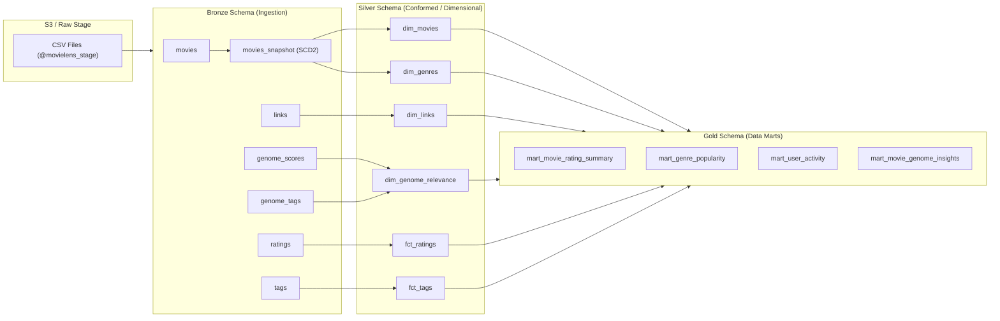

# 🎬 MovieLens ELT Framework with dbt & Snowflake

[](https://ronak-2002.github.io/dbt-snowflake-elt-framework/#!/overview)

> 📖 **Live Documentation & Lineage DAG**: Explore the full, interactive data catalog, column definitions, and model dependency graph at **[dbt Docs](https://ronak-2002.github.io/dbt-snowflake-elt-framework/#!/overview)**.

A production-grade, modular ELT pipeline implementing the Medallion (Multi-Hop) Architecture on Snowflake using dbt. This framework ingests raw MovieLens event and dimension data, tracks slowly changing dimensions (SCD Type 2), curates dimensional models, and serves high-performance analytics marts.

---

## 1. 🏗️ Architecture & Data Lineage

The project follows a 4-tier Medallion Architecture with strict schema separation:



### Schema Responsibilities

| Layer | Schema | Purpose & Scope | Storage Materialization |
|---|---|---|---|
| **Raw** | `raw` | External cloud stage (`@movielens_stage`) referencing raw CSV files on Amazon S3. | External Stage |
| **Bronze** | `bronze` | High-fidelity ingestion layer. Maps stages directly to typed tables, handles file format pre-hooks, and records ingestion metadata (`_loaded_at`). Hosts the `movies_snapshot` SCD2 table. | `table` / `snapshot` |
| **Silver** | `silver` | Conformed enterprise layer (Kimball Fact & Dimension model). Deduplicates transactional events (`fct_ratings`, `fct_tags`), parses regex attributes (`movie_name`, `release_year`), flattens arrays (`dim_genres`), and converts epoch ints to `TIMESTAMP_NTZ`. | `table` |
| **Gold** | `gold` | Business-level analytical data marts. Pre-computes aggregations, weighted Bayesian average scores, genre cohort trends, and 360° user profiling for BI dashboards. | `table` |

---

## 2. 🧪 Quality Assurance & Multi-Tier Testing

We adhere to a "shift-left" testing philosophy with three complementary testing layers:

```
          ┌─────────────────────────────────┐
          │   Singular Data Integrity Tests │  (Source row counts, future dates, schemas)
          ├─────────────────────────────────┤
          │   Generic Contract Schema Tests │  (not_null, unique, relationships)
          ├─────────────────────────────────┤
          │   Native Mock Unit Tests        │  (Regex, deduplication, timestamp logic)
          └─────────────────────────────────┘
```

### A. Mock Unit Tests (`test_type:unit`)
Declared in `models/silver/unit_tests.yml`. These tests validate complex transformation logic in isolation using synthetic input fixtures without touching production warehouse data:
- **`test_dim_movies_parsing_and_active_filter`**: Verifies title regex parsing into `movie_name` and `release_year`, plus active SCD2 version filtering (`dbt_valid_to IS NULL`).
- **`test_dim_genres_flattening`**: Validates unnesting pipe-delimited genres (`Action|Comedy`) into distinct rows using `LATERAL FLATTEN`.
- **`test_fct_ratings_dedup_and_timestamp`**: Validates latest-event deduplication per user/movie and epoch-to-`TIMESTAMP_NTZ` conversion.
- **`test_fct_tags_dedup_and_timestamp`**: Validates deduplication per user/movie/tag.
- **`test_dim_genome_relevance_join`**: Validates join logic between genome tags and relevance scores.

### B. Generic Schema Tests
Configured across `schema.yml` files in bronze, silver, and gold:
- **Uniqueness & Non-null**: Primary keys and surrogate keys (`movie_id`, `movie_version_key`, `user_id`, etc.).
- **Referential Integrity**: `relationships` tests ensuring foreign keys in facts and satellite dimensions reference valid keys in `dim_movies`.
- **Accepted Values**: Categorical boundary enforcement (e.g., `user_segment` in `['Power Reviewer', 'Active Reviewer', 'Casual Rater']`).
- **Configured Severity Levels**: Handled known raw anomalies gracefully (e.g. `severity: warn` on `tags.timestamp`).

### C. Singular Assertion Tests (`tests/*.sql`)
Custom SQL assertions checking business invariants across models:
- `assert_row_counts_match_source.sql`: Verifies that bronze row counts match the exact raw CSV row counts.
- `assert_csv_column_counts.sql`: Validates expected stage column schemas.
- `assert_rating_values_valid.sql`: Confirms rating values fall strictly between `0.5` and `5.0` in `0.5` increments.
- `assert_no_future_timestamps.sql`: Ensures no timestamps exceed `CURRENT_TIMESTAMP()`.
- `assert_ratings_composite_key_unique.sql` & `assert_tags_composite_key_unique.sql`: Checks business composite uniqueness.

---

## 3. 🔌 Plug & Play: How to Reuse This Framework

This repository is designed as a reusable template for Snowflake + dbt ELT projects. Follow these steps to adapt it to your domain:

### Step 1: Environment Setup
1. Clone the repository and install dependencies:
   ```bash
   pip install -r requirements.txt
   ```
2. Copy `.env.example` to `.env` and fill in your Snowflake credentials:
   ```env
   SNOWFLAKE_ACCOUNT=<your-account-locator>
   SNOWFLAKE_USER=<your-username>
   SNOWFLAKE_PASSWORD=<your-password>
   SNOWFLAKE_ROLE=TRANSFORM
   SNOWFLAKE_WAREHOUSE=COMPUTE_WH
   SNOWFLAKE_DEV_DATABASE=movielens_dev
   ```

### Step 2: Configure Sources & Stages
1. Update `models/sources.yml` with your stage name and file locations:
   ```yaml
   sources:
     - name: raw_data
       database: "{{ target.database }}"
       schema: raw
       tables:
         - name: raw_my_table
           identifier: my_stage/my_file.csv
   ```

### Step 3: Run the Pipeline
```bash
# 1. Run snapshots to initialize SCD2 tracking
dbt snapshot

# 2. Ingest bronze and curate silver & gold models
dbt run

# 3. Run mock unit tests
dbt test --select "test_type:unit"

# 4. Run full integrity test suite
dbt test

# 5. Lint SQL against Snowflake standards
sqlfluff lint models/
```

---

## 4. 🚀 Future Enhancements

- **`dbt-expectations` Integration**: Add enterprise data quality assertions such as distribution percentiles, entropy checks, and regex pattern matching directly into YAML schemas.
- **Incremental Materialization**: Upgrade bronze and silver models to `materialized: incremental` using Snowflake micro-partition pruning (`merge` or `append` strategies) with `_loaded_at` watermarks to support cost-effective high-volume ingestion.
- **Wider Change Data Capture (CDC)**: Expand SCD Type 2 tracking beyond movies to user profiles and rating revisions using timestamp/check snapshot strategies.
- **Snowflake Dynamic Tables**: Implement declarative continuous data pipelines with configurable `TARGET_LAG` (e.g., 15 minutes) for real-time gold marts.
